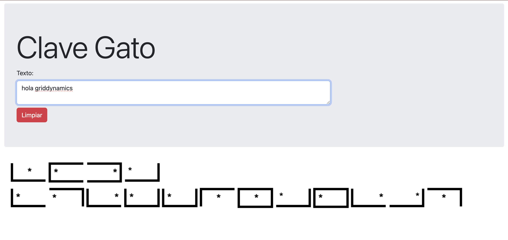

# React Gato Encoder

React Gato Encoder is a React application that translates text into Gato Code, a scout code based on a 9-quadrant system with 3 letters per quadrant (similar to T9). Each letter is represented by an image of the quadrant, with a `*` indicating the position of the letter (start, mid, or end).

## Features

- **Text-to-Gato Code Conversion**: Converts user input into Gato Code.
- **Interactive UI**: Displays the encoded Gato Code representation in real-time.
- **Clear Input**: A "Limpiar" button to reset the input field.

## Built With

- [React](https://reactjs.org/) - A JavaScript library for building user interfaces.
- [Vite](https://vitejs.dev/) - A fast build tool for modern web projects.

## Getting Started

Follow these instructions to set up and run the project locally.

### Prerequisites

Ensure you have the following installed:

- [Node.js](https://nodejs.org/) (v14 or higher)
- [npm](https://www.npmjs.com/) (comes with Node.js)

### Installation

1. Clone the repository:

   ```bash
   git clone https://github.com/your-username/react-gatocode.git
   cd react-gatocode
   ```

2. Install dependencies:

   ```bash
   npm install
   ```

3. Start the development server:

   ```bash
   npm run dev
   ```

4. Open your browser and navigate to:
   ```
   http://localhost:5173
   ```

## Usage

1. Enter text in the input field.
2. View the Gato Code representation of your text in real-time.
3. Click the **"Limpiar"** button to clear the input field.

Below is an example of the application in action:



## Application Architecture

The application is structured as follows:

```graph TD
    App[App Component]
    App --> Header[Header Component]
    App --> InputField[InputField Component]
    App --> GatoCodeDisplay[GatoCodeDisplay Component]
    App --> ClearButton[ClearButton Component]

    InputField --> TextInput[Text Input Field]
    GatoCodeDisplay --> EncodedImages[Encoded Images]
```

### Component Overview

- **App**: The main container for the application.
- **Header**: Displays the application title or branding.
- **InputField**: Handles user text input.
- **GatoCodeDisplay**: Displays the Gato Code representation of the input text.
- **ClearButton**: Resets the input field.

## Contributing

Contributions are welcome! To contribute:

1. Fork the repository.
2. Create a new branch:
   ```bash
   git checkout -b feature/your-feature-name
   ```
3. Commit your changes:
   ```bash
   git commit -m "Add your message here"
   ```
4. Push to the branch:
   ```bash
   git push origin feature/your-feature-name
   ```
5. Open a pull request.

## License

This project is licensed under the [MIT License](LICENSE).

## Acknowledgments

- Inspired by the concept of T9 text encoding.
- Special thanks to the contributors and the open-source community.
